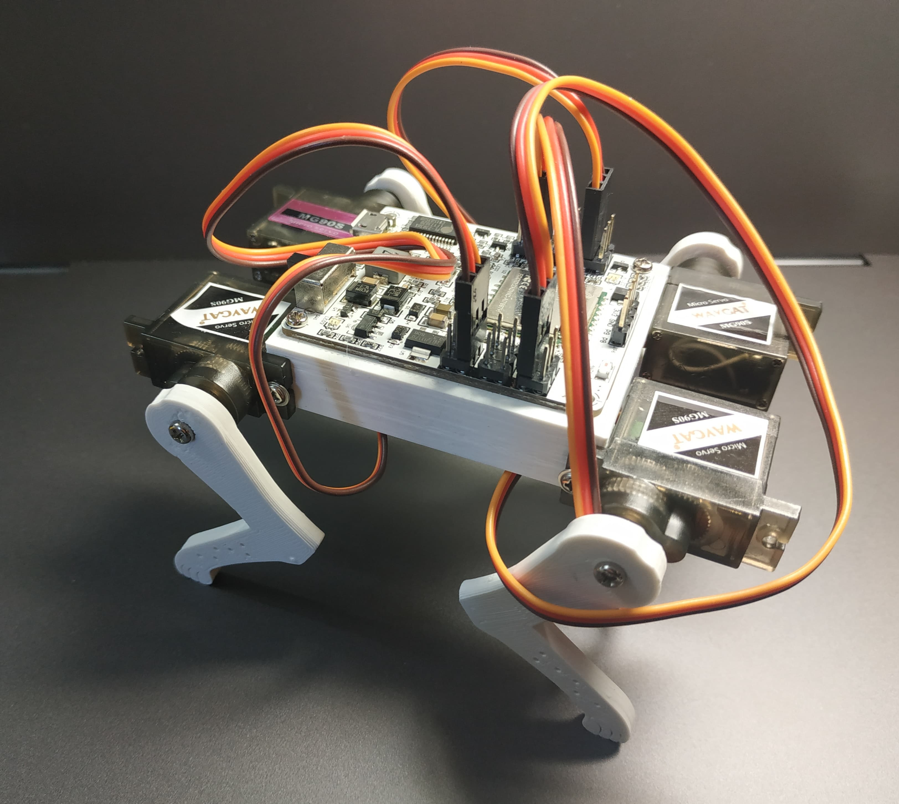
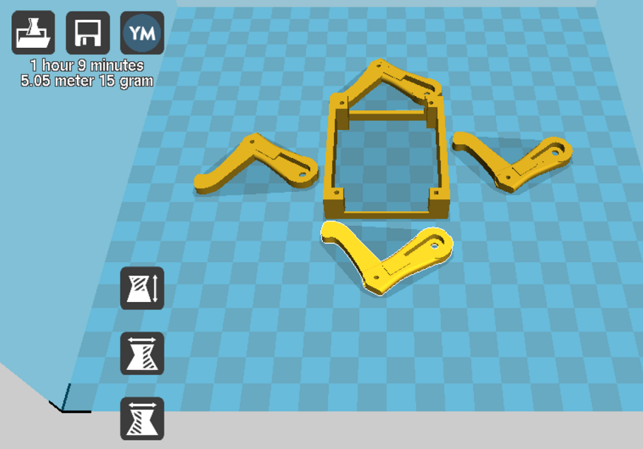
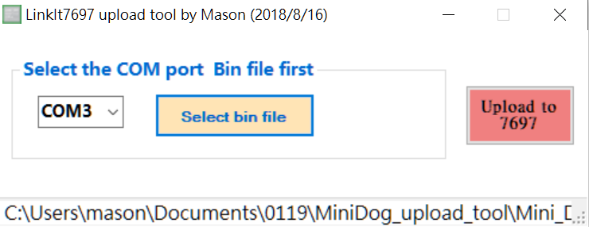
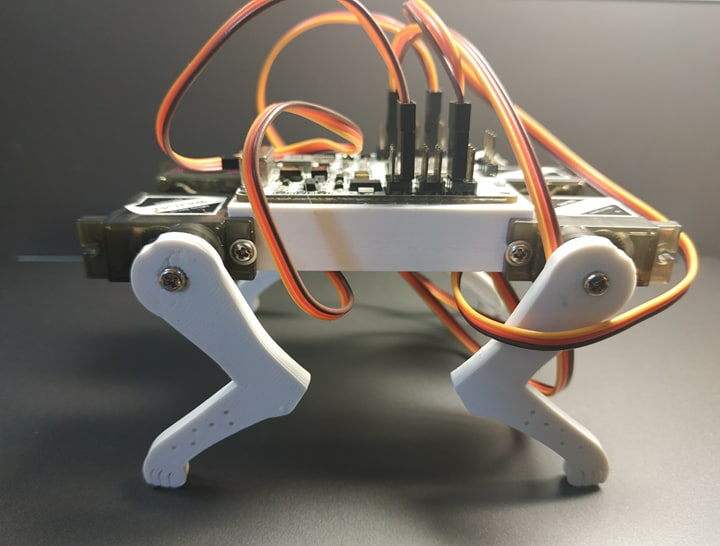
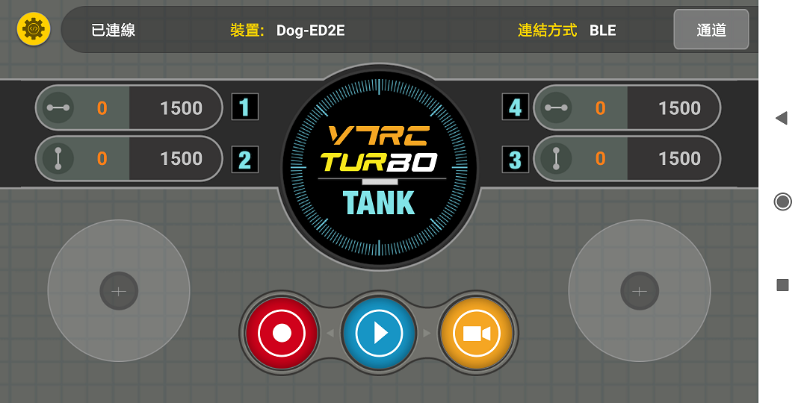
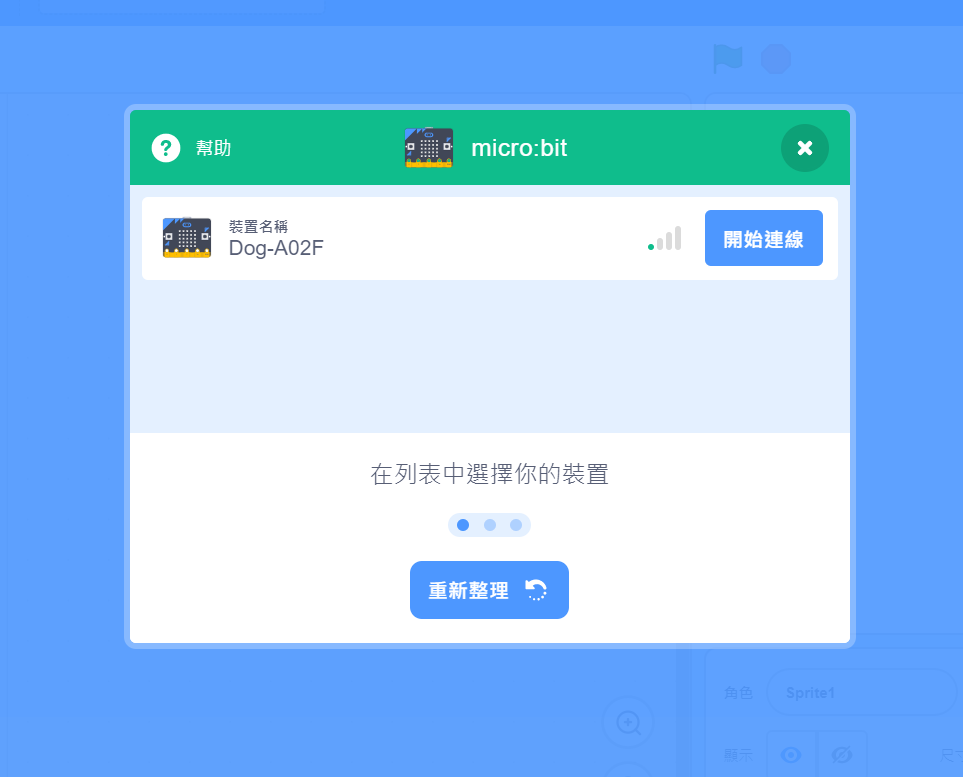
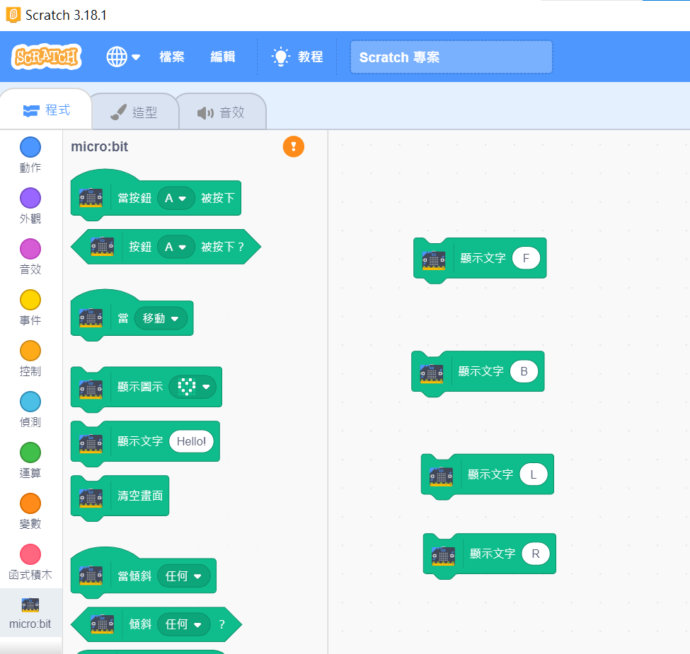

# Mini_Dog
## 使用 TinyPlan97 簡單設計的 Mini_Dog (https://www.facebook.com/mason.chen.1420) 

## 操作軟體使用 V7RC 為嵐奕科技設計的 app  (https://www.facebook.com/v7ideaTech/)

## 主控制板 TinyPlan97 為 MiniPlan 設計的硬體 (https://www.facebook.com/MiniPlanRobot)

## 材料 : 
- TinyPlan97 x 1 
- SG90 x 4 or MG90S x 4
- 3d 零件 x 5 (底座 x 1 , 左右 Mirror 腳各 2) 

- M2x8 螺絲 x 2  (鎖固 TinyPlan97 用)

## 步驟一: 燒錄程式
1. 先用 usb 插上 TinyPlan97
2. 打開 upload tool, 選擇 com port 及要上傳的 bin file : Mini_Dog_7697_V7RC_V101.ino.bin

3. 按右邊 Upload to 7697 鍵後，出現燒錄視窗，此時可看到 TinyPlan97 燒錄燈亮起，待視窗及燒錄燈熄時即燒錄成功

## 步驟二: 組裝

1. 先將TinyPlan97 放在底座中間，斜對角鎖上 M2x8 螺絲
2. 將四顆 SG90 馬達，鎖在底座四邊
3. 舵柄卡入腳部 3D 件並合上軸心
4. SG90 使用有華司的螺絲鎖上 (注意: MG90S 需使用額外長的 M2.6 螺絲才能鎖固) 
5. 馬達接線 : 左前 (P13)、右前 (P5)、左後 (P17)、右後 (P3)

## 步驟三: 使用 V7RC 來操作

1. 手機或平板先裝上 V7RC (IOS/Android 皆可) 
2. 將 Mini Dog 上電，V7RC 點裝置應可找到 Dog-XXXX 的裝置並連接上
3. 控制介面選"坦克"模式即可控制

## 2021/1/21 實驗用 Scratch 3 來控制
1. 請改燒錄 Mini_Dog_7697_SC3_V103.ino.bin 
2. 使用官方版 Scratch 3, 把 Mini Dog 當成 microbit 裝置 (需安裝 Scratch link 來連線) 

3. 用 microbit 顯示文字積木來控制.  F 前進，B 後退，L 左轉、R 右轉 

